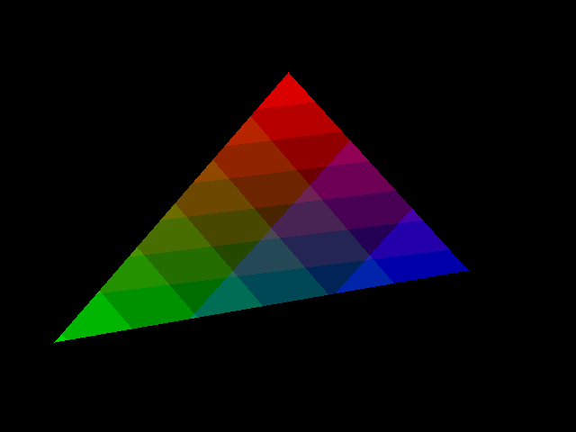
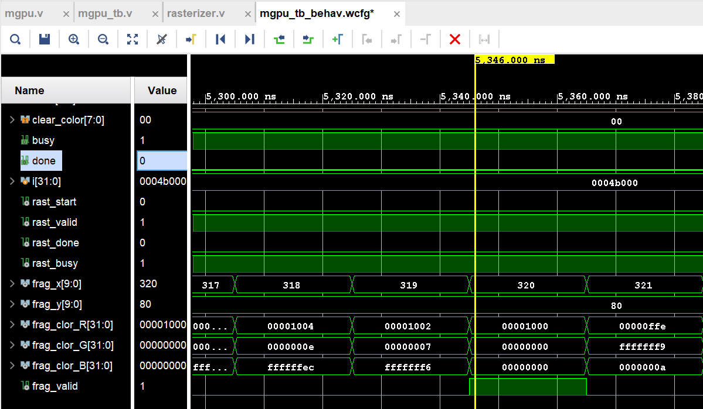
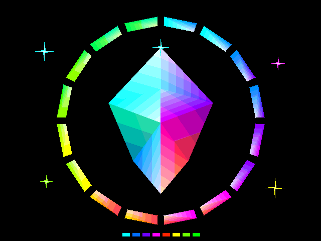

> 当前板级入口是 `top.v`，主仿真入口是 `top_tb.v`。Studio 的最新操作说明见 [top 工作流](docs/studio_top_workflow.md)，清屏接口见 [硬件清屏](docs/top_hardware_clear.md)。下方早期开发记录保留作学习参考。
>
> 仿真、导出和构建结果统一写入 `out/`，不提交 Git；Vivado 缓存和 runs 也不提交。首次运行请通过 Studio 或构建脚本生成结果。

# M-GPU

完全无GPU基础，边做边学，纯老一辈手工敲代码项目。

基于 VGA 屏幕 **640*480** **RGB332**。

<br>


## **已经做的**

- **ver1.0 基于纯FSM的Rasterize和直接写Frame buffer**

<figure align="center">



<figcaption>
<small>
测试光栅化与颜色插值 (python脚本直接读，无上板)
</small>
</figcaption>

</figure>


<br><br>


- **ver1.1 分离Rasterizer出来到rasterizer.v**

<figure align="center">



<figcaption>
<small>
再见了一坨中间变量>0<
</small>
</figcaption>

</figure>


<br><br>

- **ver1.2 加入RAST-SHAD-FIFO衔接两模块**

<figure align="center">



<figcaption>
<small>
GPT生成的testbench
</small>
</figcaption>

</figure>


<br>

## **将要做的**

- ~~做一个Fragment FIFO。~~

- 做一个Fragment Shader

- 引入Depth

- 做一个Vertex Shader

- ~~做一个VGA模块，上板收敛时序~~
  
<br>

## **目标做的**

**用C命令CPU命令GPU渲染一个3D旋转Cube在VGA屏幕上转圈圈！！！**

<br><br><br>

# 其他功能脚本
## Framebuffer Studio：实时观察与回放

testbench 现在会把每一次实际 framebuffer 写入记录到
`out/framebuffer.trace`，并记录三角形开始、完成和仿真结束事件。
GUI 按这些事件重建画面，可以看到绘制顺序，也可以回到过去查看被覆盖前的像素。
最终的 `out/framebuffer.hex` 仍然保留。

### 启动

使用带 Tkinter 的 Python 3.10 或更高版本，安装 Pillow：

```powershell
python -m pip install Pillow
```

在项目根目录打开实时窗口，然后在另一个终端或 Vivado 中运行仿真：

```powershell
python tools/view_framebuffer.py --live
```

窗口可以先于日志文件启动，会等待文件出现。Icarus Verilog 的运行命令：

```powershell
iverilog -g2012 -s mgpu_tb -o out/mgpu_tb.vvp MGPU.srcs/sources_1/new/mgpu.v MGPU.srcs/sources_1/new/rasterizer.v MGPU.srcs/sources_1/new/fifo.v MGPU.srcs/sources_1/new/shader.v MGPU.srcs/sources_1/new/regs.v MGPU.srcs/sim_1/new/mgpu_tb.v
vvp out/mgpu_tb.vvp
```

回放已有录制，或者指定其他日志路径：

```powershell
python tools/view_framebuffer.py
python tools/view_framebuffer.py path/to/framebuffer.trace
```

也可以使用 `make gui` 或 `make live`。这两个命令只打开窗口，不启动仿真。
Vivado 中的相对输出路径取决于仿真工作目录：先确保该目录存在 `out` 文件夹，
然后在 GUI 点击“打开日志”选择实际生成的 `framebuffer.trace`。

### 操作

| 控件 | 功能 |
| --- | --- |
| 实时追踪 | 持续读取新增日志，跟随最新像素；拖动或暂停会退出跟随，但不会停止读取 |
| 播放 / 暂停、Space | 从当前位置回放；在末尾点击播放会从头开始 |
| 时间轴 | 点击或拖动到任意仿真时刻；紫色刻度标记三角形完成时间 |
| −0.1 ms / +0.1 ms、左右方向键 | 向前或向后移动 0.1 ms 仿真时间 |
| 定位到 | 输入精确的毫秒数，按 Enter 或点击“跳转” |
| 上一 / 下一三角形、Ctrl + 左右方向键 | 跳转到相邻三角形完成时刻 |
| 右侧 DRAW CALLS 列表 | 选择指定三角形，显示截至该三角形完成的累计画面 |
| 仅看选中三角形 | 隐去其他三角形；未手动选择时显示当前时间对应的三角形 |
| 三角形轮廓 | 叠加当前查看三角形的边界，便于核对几何位置 |
| 仿真 ms / 秒 | 播放速度：例如 `1` 表示每秒播放 1 ms 仿真时间，`0.01` 更慢 |
| 导出当前画面 | 将当前时间、当前查看模式下的原始分辨率画面保存为 PNG |

实时模式显示的是**仿真已写到文件的最新状态**。testbench 每 256 个像素及每个
三角形边界刷新日志，因此它不是每个时钟都刷新窗口。暂停、倒退和慢放不会丢失
后续日志；重新运行仿真覆盖日志时，窗口会重新载入。没有结束标记的日志可以播放
已记录的部分，但不视为成功完成。

原来的静态转换命令保持兼容：

```powershell
python tools/view_framebuffer.py out/framebuffer.hex
```

### 文件与验证

- `tools/view_framebuffer.py`：入口，同时保留 HEX → PNG/PPM 转换。
- `tools/framebuffer_trace.py`：增量日志读取、历史颜色恢复和检查点跳转。
- `tools/framebuffer_gui.py`：桌面 GUI。
- `.trace` 和 Python 缓存已加入 `.gitignore`，避免提交大量运行数据。

```powershell
python -m unittest discover -s tools -p "test_*.py" -v
```

测试覆盖覆盖写入后的回退、时间边界、独立三角形显示、随机跳转、增量读取和日志
重启；存在仿真输出时，还会比对完整回放与 `framebuffer.hex`，并验证每个三角形
完成时刻的画面。GUI 测试还会验证播放速度、精确跳转、三角形导航、PNG 导出与旧版
HEX 转换命令。当前日志格式面向本 testbench 的串行三角形提交；未来若同时处理
多个三角形，需要把真实的三角形编号随片元一路传递到写回阶段。

## Image Studio：图片 → 三角形 → GPU

主窗口右上角点击 **图片 → 三角形**，可将全彩图像转换为 GPU 能绘制的三角形。
图片处理使用 Pillow 和 NumPy：

```powershell
python -m pip install Pillow numpy
python tools/view_framebuffer.py
```

1. 点击“导入图片”，选择 PNG、JPEG、WebP、BMP、GIF 或 TIFF；动画使用第一帧。
2. 在 640×480 预览中拖动图片，或填写 X、Y、宽度和高度（Enter 应用）。支持锁定比例、
   居中和适合屏幕；超出屏幕的部分会裁掉。
3. 选择背景颜色。完全透明区域跳过，半透明像素先与选定背景合成，再量化为 RGB332。
   GPU 本身仍只有 RGB332 帧缓冲，没有新增运行时 alpha 混合或纹理采样。
4. 选择精度模式，点击 **生成三角 + Testbench**。
5. 可在“原图合成 / RGB332 / 三角形预览”间比较，并开启网格。界面会显示三角形数量、
   可见像素 RGB 均方根误差和与 RGB332 目标逐像素一致的比例。
6. 点击 **运行 GPU 仿真并查看**。安装 Icarus Verilog 后会自动编译、仿真，并在主窗口
   实时显示写入；完成后自动比对 GPU 输出与三角形预览，保存 `out/framebuffer.png`。
   可以取消运行，后台任务不会阻塞窗口。

### 如何划分

先在目标屏幕合成、缩放并量化图片，再按局部颜色误差自适应划分像素区域。
每个区域比较两种对角线，选择更接近原图的两个渐变三角形；误差较大的区域优先细分，
平坦区域保持大三角形。透明边缘优先处理，完全透明的块不生成绘制指令。
这是一种适合当前 RTL 的自适应方法，不保证数学上的全局最少三角形数。

| 模式 | 默认误差容限 | 默认三角形上限 | 用途 |
| --- | --- | --- | --- |
| 精确还原 | 0 | 160000 | 完整保留合成、缩放、RGB332 量化后的像素 |
| 均衡细节 | 8 | 12000 | 在细节和仿真时间之间折中 |
| 较少三角形 | 20 | 3000 | 较快验证整体图形 |

误差单位是 RGB888 通道值（0～255），衡量三角形结果相对于 RGB332 目标的差别，
不包含全彩转换为 RGB332 本身的损失。达到数量上限时会明确标为近似结果；如果数量
不足以保留透明边缘，会要求提高上限或缩小图片。

最小块为 2×2 像素，用两个非退化三角形匹配四个像素，可处理单像素细节和透明孔洞。
混合透明与不透明的最小块会将透明采样点绘制为选定背景色。精确模式最坏约需 153600
个三角形（非黑背景再增加 2 个），照片建议先缩小或使用均衡模式。

预览模拟当前 RTL 的整数采样、Q12 梯度截断和最终颜色舍入。为确保纯色能正确往返，
本次将定点颜色转 RGB332 改为四舍五入，修复了原来两次截断导致部分通道降低一级的问题。

### 生成的文件

| 文件 | 内容 |
| --- | --- |
| `out/image_scene.tri` | 三角形数量，以及每个三角形的三个坐标和 RGB332 顶点颜色 |
| `out/mgpu_image_tb.v` | 可独立编译的图片 testbench，顶层模块为 `mgpu_image_tb` |
| `out/image_target.png` | 合成和量化后的目标图片 |
| `out/image_prediction.png` | 使用实际 RTL 算法预测的三角形绘制结果 |
| `out/image_expected.hex` | 用于与仿真输出逐像素核对的数据，不写入 DUT |
| `out/image_scene.json` | 图片来源、位置、数量和误差指标 |
| `out/image_simulation.log` | 一键仿真的编译与运行日志 |

生成的 testbench 通过正常的 `start`、顶点坐标和颜色接口提交三角形，数据仍经过
Rasterizer → FIFO → Shader → Frame Buffer，不会把原图直接灌入帧缓冲。

原有 `mgpu_tb.v` 也增加了图片场景入口：在仿真工作目录下找到 `out/image_scene.tri`
时自动绘制该图片；没有该文件则仍绘制霓虹晶体。可在命令行指定场景或选择原演示：

```powershell
vvp out/mgpu_tb.vvp +IMAGE_SCENE=out/image_scene.tri
vvp out/mgpu_tb.vvp +DEMO
```

修改 testbench 后需要重新编译再运行；也可以在 GUI 生成完成后执行：

```powershell
make simulate-image
```

Vivado 可以使用当前 `mgpu_tb` 并配置场景路径，或添加生成的 `out/mgpu_image_tb.v`，
将仿真顶层设为 `mgpu_image_tb`。生成文件使用场景的绝对路径，移动项目后应重新生成；
日志和 framebuffer 仍输出到仿真工作目录的 `out` 文件夹，请先确保该文件夹存在。

测试覆盖全 256 色、PNG 调色板透明度、半透明合成、屏幕裁剪、拖动与缩放、后台生成，
并实际编译运行生成的 testbench，比对 GPU 输出、软件预览和事件日志。
