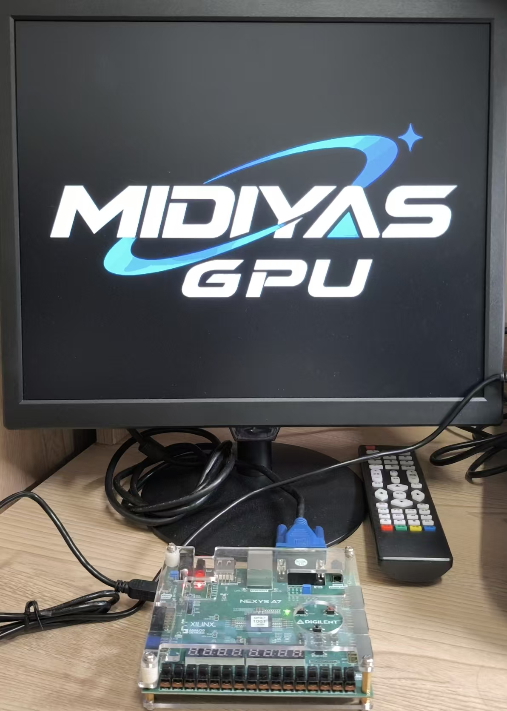

# M-GPU

完全无GPU基础，边做边学，纯老一辈手工敲代码项目。

基于 VGA 屏幕 **640*480** **RGB332**。

 

## **已经做的**

- **ver1.0 基于纯FSM的Rasterize和直接写Frame buffer**

<figure align="center">

<figcaption>
<small>
测试光栅化与颜色插值 (python脚本直接读，无上板)
</small>
</figcaption>

</figure>

  

- **ver1.1 分离Rasterizer出来到rasterizer.v**

<figure align="center">

<figcaption>
<small>
再见了一坨中间变量>0<
</small>
</figcaption>

</figure>

  

- **ver1.2 加入RAST-SHAD-FIFO衔接两模块**

<figure align="center">

<figcaption>
<small>
GPT生成的testbench
</small>
</figcaption>

</figure>

 

- **ver1.3 加入VGA模块与可控制顶层top.v**
  
<figure align="center">

<figcaption>
<small>
上VGA！
</small>
</figcaption>

</figure>

 

## **将要做的**

- ~~做一个Fragment FIFO。~~

- 做一个Fragment Shader

- 引入Depth

- 做一个Vertex Shader

- ~~做一个VGA模块，上板收敛时序~~
  
 

## **目标做的**

**用C命令CPU命令GPU渲染一个3D旋转Cube在VGA屏幕上转圈圈！！！**

   

