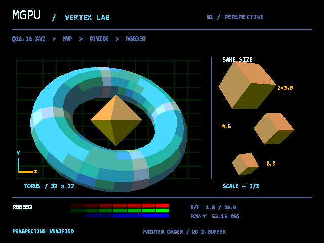
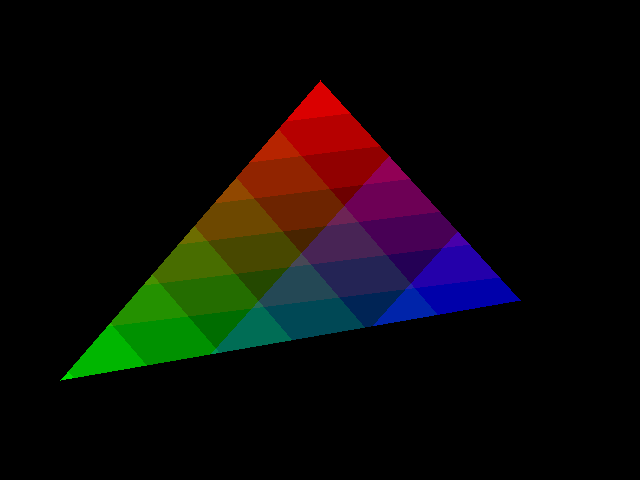
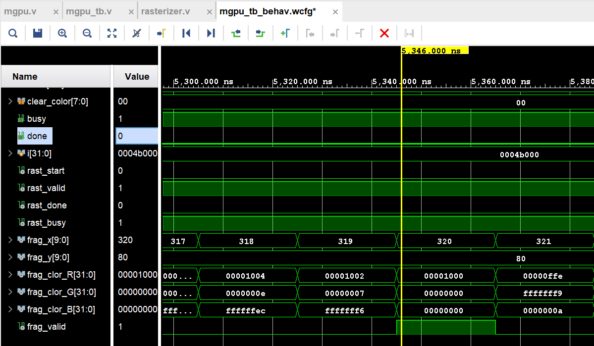
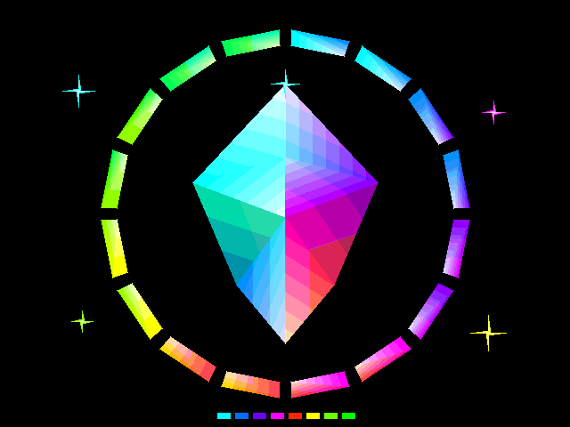
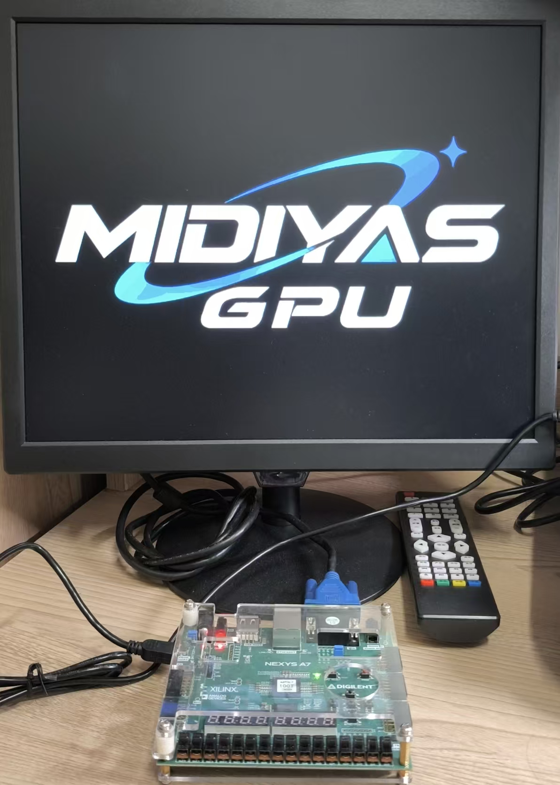

# M-GPU

完全无GPU基础，边做边学，纯老一辈手工敲代码项目。

基于 VGA 屏幕 **640*480** **RGB332**。

## 当前默认测试：3D 顶点实验台

`top.v` 内置 4,310 个三角形的三维顶点数据，坐标使用 signed Q16.16、颜色使用 RGB332。场景包含倾斜圆环、中心八面体、相同世界尺寸但位于不同深度的三个立方体，以及 RGB332 色阶。

顶点通过 `mgpu` 的 vertex shader 完成矩阵变换、透视除法和视口映射，再由光栅器和 fragment shader 写入 framebuffer。默认投影为 `clip_x=1.5*x`、`clip_y=2*y`、`clip_z≈(11/9)*z-20/9`、`clip_w=z`，相机朝 +Z，近远平面为 1 和 10。ROM 内另存的整数屏幕坐标仅供仿真比对，不作为默认场景的 GPU 顶点输入。

目前尚无 Z-buffer 和三角形裁剪。三维物体采用预先按平均深度排序的绘制顺序，面颜色预先计算；这不等同于通用遮挡消除或运行时光照。全部顶点都位于视锥内。复位后清屏绘制，完成后保持画面，BTNU 可清屏重绘。

- 运行 `python tools/view_framebuffer.py`，选择“3D 顶点实验台”进行仿真、实时观察或逐三角形回放；图片导入功能仍走独立的二维兼容矩阵。
- `make` 默认仿真 `top_tb`，结果写入 `out/framebuffer.hex` 和 `out/framebuffer.trace`。
- 修改场景可编辑 `tools/build_vertex_lab.py`，再运行该脚本重新生成 `top.v` 内的三维 ROM。生成脚本依赖 NumPy、Pillow 和 Windows Consolas 字体，已生成的 RTL 不依赖 Python。
- 当前验证：4,310 次顶点变换与预期坐标一致；最终 307,200 个像素与独立边函数参考渲染完全一致；图片导入的五项回归测试通过。此处记录的是 RTL 仿真，尚未验证新版设计的综合资源、时序及上板效果。

`tools/build_space_demo.py` 保留为旧二维演示生成器，运行它会替换当前 `top.v`。

 

## **已经做的**

- **ver1.0 基于纯FSM的Rasterize和直接写Frame buffer**

<figure align="center">

<figcaption>
<small>
测试光栅化与颜色插值 (python脚本直接读，无上板)
</small>
</figcaption>

</figure>

  

- **ver1.1 分离Rasterizer出来到rasterizer.v**

<figure align="center">

<figcaption>
<small>
再见了一坨中间变量>0<
</small>
</figcaption>

</figure>

  

- **ver1.2 加入RAST-SHAD-FIFO衔接两模块**

<figure align="center">

<figcaption>
<small>
GPT生成的testbench
</small>
</figcaption>

</figure>

 

- **ver1.3 加入VGA模块与可控制顶层top.v**
  
<figure align="center">

<figcaption>
<small>
上VGA！
</small>
</figcaption>

</figure>

 

## **将要做的**

- ~~做一个Fragment FIFO。~~

- 做一个Fragment Shader

- 引入Depth

- 做一个Vertex Shader

- ~~做一个VGA模块，上板收敛时序~~
  
 

## **目标做的**

**用C命令CPU命令GPU渲染一个3D旋转Cube在VGA屏幕上转圈圈！！！**

   

